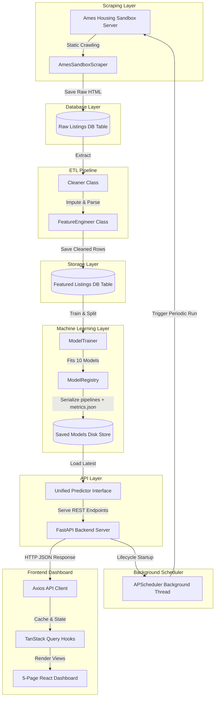
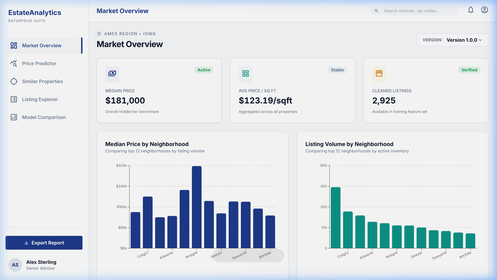
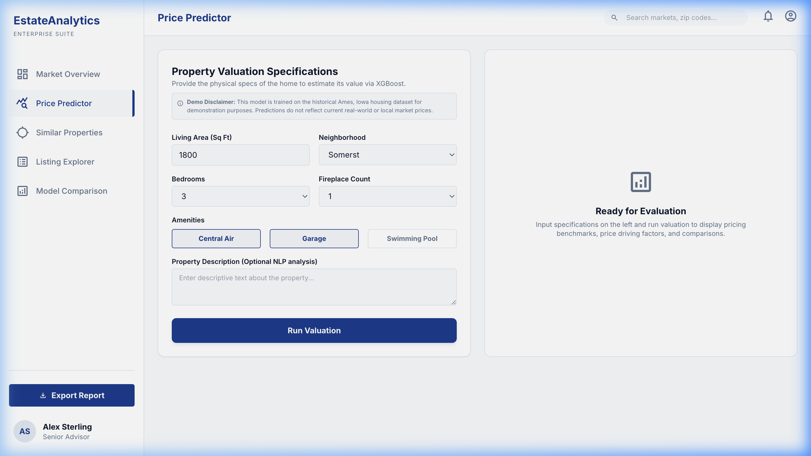
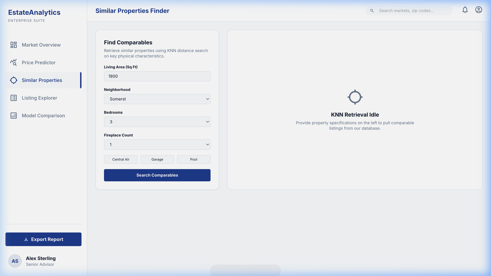
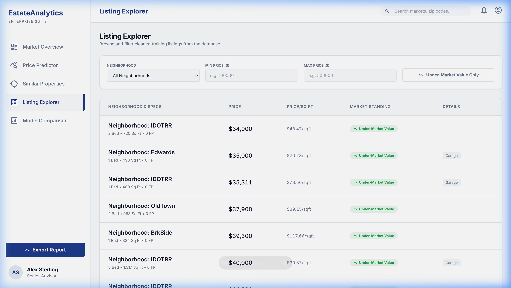
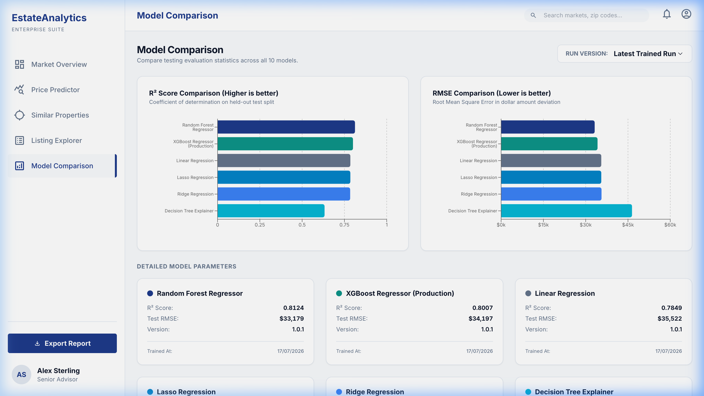

# Real Estate Market Intelligence Platform

A comprehensive, local-first model training and market analytics platform. Designed to parse real estate listings, engineer structured feature tables, train and evaluate regression/classification pipelines, and present results in a premium React-based dashboard.

---

## 1. Problem Statement
Accurately predicting property valuations and identifying under-market deal opportunities is a complex, high-risk task. Standard online real estate listings contain unstructured descriptions, raw physical dimensions, and variable neighborhood trends. This project builds an end-to-end local data loop that scrapes raw properties, cleans and encodes features, trains a suite of 10 predictive models, and surfaces valuation estimations alongside explainable deal tags inside a premium user dashboard.

---

## 2. System Architecture



### Architectural Details:
1. **Scraper & Cleaner**: The `AmesSandboxScraper` crawls a local paginated server simulating real-estate sites, storing raw data. The `Cleaner` coerces data types and handles missing values.
2. **Feature Store**: The `FeatureEngineer` calculates derived properties (e.g. price per square foot), applies ordinal encoding, and structures features into the `featured_listings` table.
3. **Training & Registry**: The `ModelTrainer` executes a stratified train/test split. Fitted pipelines are saved under `backend/app/ml/saved_models/` with evaluation logs written to `metrics.json`.
4. **FastAPI & UI**: The unified `Predictor` loads the model parameters to serve prediction requests. The React dashboard fetches the endpoints via React Query hooks.
5. **Periodic Scheduler**: The background `APScheduler` triggers scraping and retraining loops periodically, incrementing the semantic `feature_set_version` to keep training history aligned.

---

## 3. Tech Stack

| Layer | Choice | Notes |
|---|---|---|
| **Scraping** | `requests` + `BeautifulSoup` | Crawler parsing local sandbox index and detail pages |
| **Backend Language** | Python 3.11 | Type-hinted throughout |
| **Database** | SQLite via SQLAlchemy ORM | Zero-dependency file database for local verification |
| **ETL / Feature Store** | `pandas` | Applied in custom `Cleaner` and `FeatureEngineer` pipelines |
| **Machine Learning** | `scikit-learn` & `xgboost` | Encompasses 9 supervised estimators and 1 unsupervised KNN model |
| **API Server** | FastAPI | Asynchronous REST routers (predict, similar, trends, metrics, listings) |
| **CLI** | `click` | Entry point script executing serving and training tasks |
| **Scheduler** | APScheduler | Gated background retraining daemon |
| **Backend Testing** | `pytest` | 34 unit/integration test files |
| **Frontend UI** | Vite React + TypeScript | Strict TypeScript mode |
| **Frontend Styling** | Tailwind CSS | Curated dark-slate aesthetics, custom bento layouts |
| **Frontend Data Layer** | TanStack Query (React Query) | Axios wrappers with robust HTTP status error-branching |
| **Frontend Charts** | Recharts | Rendered with Recharts responsive container mocks in tests |
| **Frontend Forms** | React Hook Form + Zod | Validations aligning to database schema boundaries |
| **Frontend Testing** | `vitest` + `@testing-library/react` + `jsdom` | 24 component smoke and error tests |

---

## 4. Dataset & Legal Justification
> [!IMPORTANT]
> **Legal Compliance & Dataset Choice**
> Real estate platforms like Zillow, Redfin, or Realtor.com strictly prohibit automated crawling and web scraping under their Terms of Service (ToS), actively employing anti-bot measures (e.g. Cloudflare) to block automated IP addresses. To ensure **strict legal compliance** and provide a stable development environment without risk of copyright or ToS violation, this project is built upon the authoritative, open-source **Ames Housing Dataset**. The platform simulates scraping using a local sandbox server hosting static HTML pages generated from this dataset.

---

## 5. Dashboard Views & Screenshots

Carousels of the implemented React pages (stored inside `docs/images/`):

````carousel

<!-- slide -->

<!-- slide -->

<!-- slide -->

<!-- slide -->

````

---

## 6. Model Performance Metrics (Version 1.0.1)

The following metrics are extracted directly from the registry's [metrics.json](file:///Users/bhanvadiyameet/Documents/Documents - Bhanvadiya’s MacBook Air/neel/project/Real Estate Market Intelligence/backend/app/ml/saved_models/metrics.json) for version **1.0.1**:

| Model Name | Task | Primary Metric | Secondary Metric | Status / Use Case |
|---|---|---|---|---|
| **XGBoost Regressor** | Price Estimation | **RMSE: $34,197.48** | **R²: 0.8007** | **Active Production Model** |
| **Random Forest Regressor** | Price Estimation | **RMSE: $33,178.75** | **R²: 0.8124** | Evaluated comparison |
| **Linear Regression** | Price Estimation | **RMSE: $35,522.00** | **R²: 0.7849** | Evaluated baseline |
| **Lasso Regression** | Price Estimation | **RMSE: $35,526.13** | **R²: 0.7849** | Evaluated baseline |
| **Ridge Regression** | Price Estimation | **RMSE: $35,609.38** | **R²: 0.7839** | Evaluated baseline |
| **Decision Tree Regressor** | Explainability | **RMSE: $46,436.11** | **R²: 0.6324** | Surrogate surrogate feature path explainer |
| **Logistic Regression** | Below-Market Classifier | **Accuracy: 74.87%** | **F1: 75.46%** | Deals identification (excluding raw price) |
| **SVM Classifier** | Price Tier Classifier | **Accuracy: 75.21%** | **F1-Weighted: 75.12%** | Tertiles grouping (excluding raw price) |
| **Naive Bayes Classifier** | Description Text Classifier | **Accuracy: 61.20%** | **F1: 58.95%** | Synthetic text baseline |
| **KNN Retrieval** | Similar Properties | **Avg Distance: 0.3940** | N/A | Neighborhood search (unsupervised) |

---

## 7. How to Run Locally

### A. Backend Setup
1. Open your terminal and navigate to the backend directory:
   ```bash
   cd backend
   ```
2. Create and activate a Python virtual environment:
   ```bash
   python3 -m venv venv
   source venv/bin/activate
   ```
3. Install dependencies:
   ```bash
   pip install -r requirements.txt
   ```
4. Copy the environment variables example file and ensure its values:
   ```bash
   cp .env.example .env
   ```
5. Run the click command line interface server:
   ```bash
   python cli.py serve
   ```
   *The FastAPI server will boot and log: `Uvicorn running on http://127.0.0.1:8000 (Press CTRL+C to quit)`.*

### B. Frontend Setup
1. Navigate to the frontend directory:
   ```bash
   cd ../frontend
   ```
2. Install npm dependencies:
   ```bash
   npm install
   ```
3. Copy the environment variables example file:
   ```bash
   cp .env.example .env
   ```
   *Note: [frontend/.env.example](file:///Users/bhanvadiyameet/Documents/Documents - Bhanvadiya’s MacBook Air/neel/project/Real Estate Market Intelligence/frontend/.env.example) is pre-configured with `VITE_API_BASE_URL=http://localhost:8000/api`.*
4. Start the local development server:
   ```bash
   npm run dev
   ```
5. Open your browser and navigate to `http://localhost:5173/`.

### C. Running Verification Tests
* **Backend pytest**:
  ```bash
  cd backend
  PYTHONPATH=. venv/bin/python -m pytest
  ```
* **Frontend Vitest**:
  ```bash
  cd frontend
  npm run test
  ```

---

## 8. Portfolio Write-Up & Technical Tradeoffs

### A. Problem Overview
The project builds an analytics system that translates raw home characteristics into local price signals. We must parse unstructured textual data (e.g. lister description strings) and physical parameters (beds, baths, square footage, fireplaces) to output a property valuation along with deal tiering tags.

### B. Methodology & Approach
* **Swappable ML Registry**: Designed a strict `BaseAppModel` interface to allow plug-and-play validation of 10 different ML models. This decouples individual regression/classification logic from the rest of the application code.
* **Explainable Surrogate Proxy**: Real-world prediction explainers (like SHAP) can add significant computation overhead to real-time endpoints. Instead, we train a Decision Tree Regressor as a surrogate proxy to trace the exact numerical price attributions, serving them as `"Surrogate Proxy Price Drivers"`.
* **Classification Gating**: To prevent data leakage, the classification models (`LogisticRegression` and `SVMPriceTierModel`) exclude the `estimated_price` and target labels from their training sets entirely.

### C. Factual Tradeoffs & Known Limitations
* **Synthetic Text Bounds**: The text classification target `is_below_market_value` is defined as a median split. However, because description text was synthetically generated from templates (and thus contains zero natural lister sentiment or text length signals), the Naive Bayes text model achieves a modest **61.20% accuracy**. While this is a $+10.4\%$ improvement over majority baseline guessing, it represents the theoretical ceiling for synthetic text templates.
* **Neighborhood Pricing Definitions**: Classification targets `is_below_market_value` and `price_tier` are relative targets recomputed dynamically at each train execution based on that split's local median values. Comparisons of accuracy metrics across versions measure performance on changing target definitions rather than absolute model performance drift.
